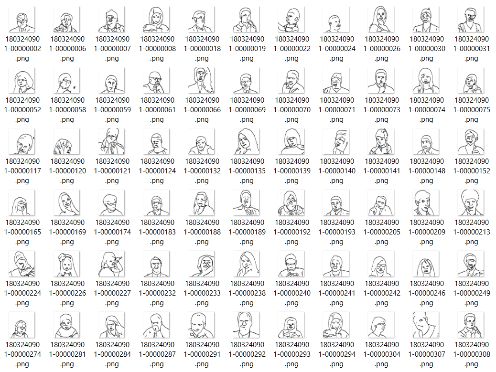
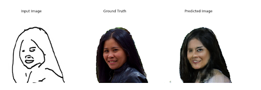
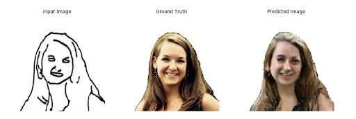
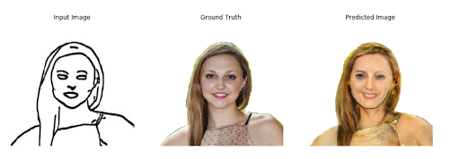
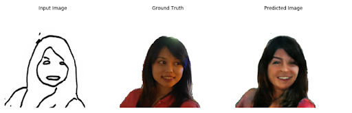
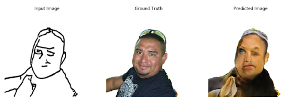
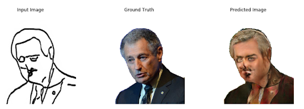

# cGAN-Sketch-to-portrait
Image-to-image translation using Conditional Adversarial Networks developed with the aim of translation sketch to portrait. Pix2pix architecture was used. 

Training dataset was prepared using <a href="https://www.kaggle.com/laurentmih/aisegmentcom-matting-human-datasets">AISegment.com - Matting Human Datasets</a>. Additionally images were cropped and resized to 256x256 pixel size.   There are only portraits images, so in order to obtain sketch images, <a href="http://www.cs.cmu.edu/~mengtial/proj/sketch/">Photo-Sketching Image</a> project was used. 


Some better and worse examples of working of network are presented below. 








## Using
To use this neural network, you should run script.py with two arguments. 
First one is path to sketch file (it was tested with sketch file 256x256, but bigger ones also should be good), which will be used to generate new photo. 
Second one is path, where new photo will be created. Example of cmd command is presented below.  
```
 python .\script.py C:\\x.png F:\\test.png
```

**Due to github's limitation of file sizes, generator model can be downloaded from drive
<a href="https://drive.google.com/open?id=1yrv9XCO7WYqeylWyfS0af5QInopJH3XA">here</a>.** 
This file should be passed to **models** directory. 
